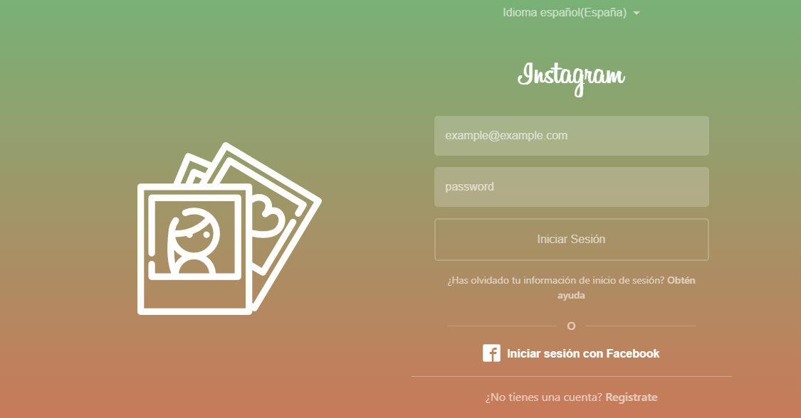
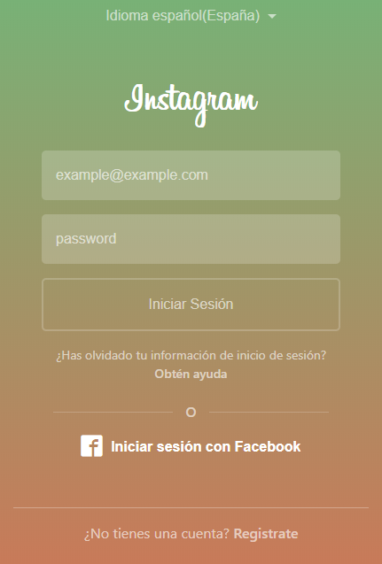
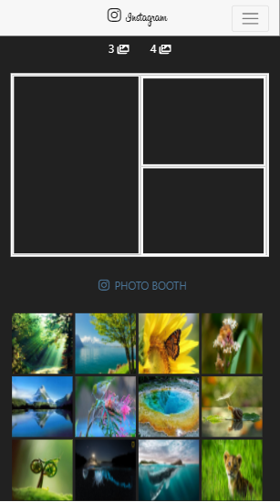

# Insta Collage
---
## Objetivo

Utilizar la api Drag and Drop de HTML5 para recrear un collage.

## Especificaciones de Desarrollo

* La página principal es denominada `index.html` en el cual se encuentra el login.

* La página principal es denominada `home.html` en el cual se encuentra el desarrollo del collage.

* En la carpeta `css` se encuentra el archivo `main.css` donde se han agragado los  estilos necesarios para el proyecto.
* Tambien se encuentra el archivo `fonts.css` donde se ha instalado la fuente `Billabong` .

* El framework utilizado es Bootstrap 4.

* En la carpeta `assets` se encuentra la carpeta `images` donde estan las imágenes necesarias para el proyecto.

* Esta web utiliza 1 tipografía :   `Sains`.

* Los íconos se obtuvieron de  [IcoMoon](https://icomoon.io/app/) y de font-awesome.

* En el desarrollo del proyecto se han utilizado diferentes tipos de efectos sobre algunos títulos e imágenes, todo esto especificado en la hoja de estilos main.css.

* Hay dos opciones de collage : 3 fotos y 4 fotos.

### Versión desktop

### Versión Mobile

Realizado por Carla Centeno y Alejandra Cabrera.